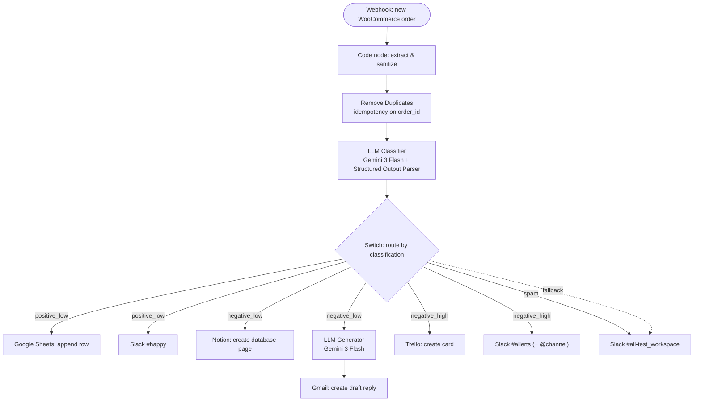

# WooCommerce AI Support Agent v1

🌐 [English](README.md) · [Українська](README.uk.md) · **Русский**

Воркфлоу n8n, который сортирует заметки к заказам WooCommerce с помощью LLM и направляет каждую в Slack, Notion, Gmail, Google Sheets или Trello — в зависимости от тональности, категории и срочности. Создан как Mini-project #4 (флагман) учебного трека по AI-автоматизации.

---

## Архитектура

---

## Что это

Когда клиент оставляет заметку к заказу WooCommerce, владельцу магазина обычно нужно её прочитать, оценить серьёзность и решить, кто должен ответить. Этот воркфлоу автоматизирует первый проход:

1. Новый заказ отправляет вебхук в n8n.
2. Заметка очищается, из заказа извлекаются ключевые поля.
3. LLM классифицирует заметку (тональность / категория / срочность) и возвращает **структурированный JSON**.
4. Switch направляет заказ в одну из четырёх веток со своими действиями.

Человек остаётся в контуре там, где это важно: ответы на негатив готовятся как **черновики Gmail** и никогда не отправляются автоматически.

## Пайплайн

| Нода | Тип | Роль |
|------|-----|------|
| `Webhook_React on new woocommerce order` | Webhook (POST) | Принимает заказ. Объект лежит под `body`. |
| `JS code_extract & sanitize` | Code (JavaScript) | Разворачивает заказ, чистит заметку от HTML, отдаёт `order_id`, `email`, `note_clean` и т.д. |
| `Remove Duplicates` | Remove Duplicates | Идемпотентность по `order_id` — повторная доставка вебхука не обрабатывается дважды. |
| `Basic LLM Chain_Classifier` | LLM (Gemini 3 Flash) | Классифицирует заметку. Парсер задаёт строгий JSON. |
| `Switch` | Switch (Rules) | Маршрутизация по `output.classification` + запасной выход Fallback. |

## Маршрутизация

| Ветка | Триггер | Действия |
|-------|---------|----------|
| **positive_low** | Благодарность, похвала, нейтральные заметки | Строка в Google Sheets · Slack `#happy` |
| **negative_low** | Мягкая/несрочная жалоба | Страница в Notion · генерация ответа вторым LLM → **черновик** Gmail |
| **negative_high** | Срочное: возврат, повреждение, гнев | Карточка в Trello · Slack `#allerts` с `@channel` |
| **spam** | Реклама, бессмысленный текст | Лог в Slack `#all-test_workspace` |
| **fallback** | Всё вне четырёх классов | Лог в Slack `#all-test_workspace` |

## Надёжность

- **Retry on fail** — на всех нодах с внешними вызовами (оба LLM, Slack, Notion, Gmail, Sheets, Trello).
- **Идемпотентность** — `Remove Duplicates` по `order_id`.
- **Error workflow** — отдельный воркфлоу уведомляет о сбоях в Slack.
- **Pin Data** — выход вебхука закреплён для воспроизводимого демо.

## Тестирование

| Ожидаемая ветка | Пример заметки |
|-----------------|----------------|
| positive_low | "Thank you so much! Super fast delivery and the product is perfect." |
| negative_low | "A bit disappointed — the item arrived with a scratch. Not urgent, but I expected better." |
| negative_high | "Unacceptable — my order arrived broken for the SECOND time. I want a full refund immediately!" |
| spam | "🔥 BUY CHEAP REPLICA WATCHES NOW!!! 90% OFF, click here!!!" |

## Технологии

n8n (self-hosted, Docker) · WooCommerce (LocalWP) · Google Gemini (Gemini 3 Flash) · Slack · Notion · Gmail · Google Sheets · Trello

## Необходимые креденшелы

| Сервис | Тип креденшела в n8n | Примечания |
|--------|----------------------|------------|
| Google Gemini | Google Gemini (API key) | Используется обеими LLM-цепочками |
| Slack | Slack API (Bot token, `xoxb-…`) | Скоупы: `chat:write`, `chat:write.public` |
| Google (Sheets + Gmail) | Google OAuth2 | Один креденшел покрывает оба |
| Notion | Notion API (integration token) | Поделитесь интеграцией с целевой базой |
| Trello | Trello API (key + user token) | Ключ привязан к Power-Up; добавьте URL n8n в Allowed Origins |

## Настройка

1. Импортируйте `workflow.json` в n8n.
2. Воссоздайте креденшелы выше (импорт переносит ссылки, не секреты).
3. Зарегистрируйте вебхук WooCommerce → Delivery URL = ваш production-URL n8n (`/webhook/…`), воркфлоу **Published**.
4. Укажите в нодах Sheets, Notion и Trello собственные ID таблицы / базы / списка.
